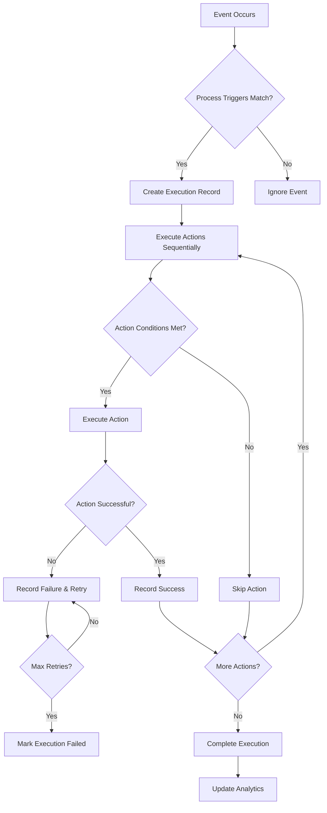
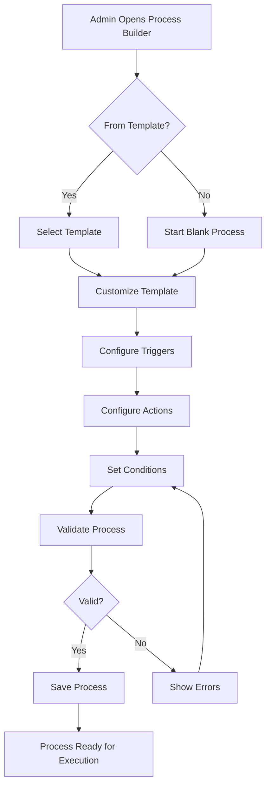
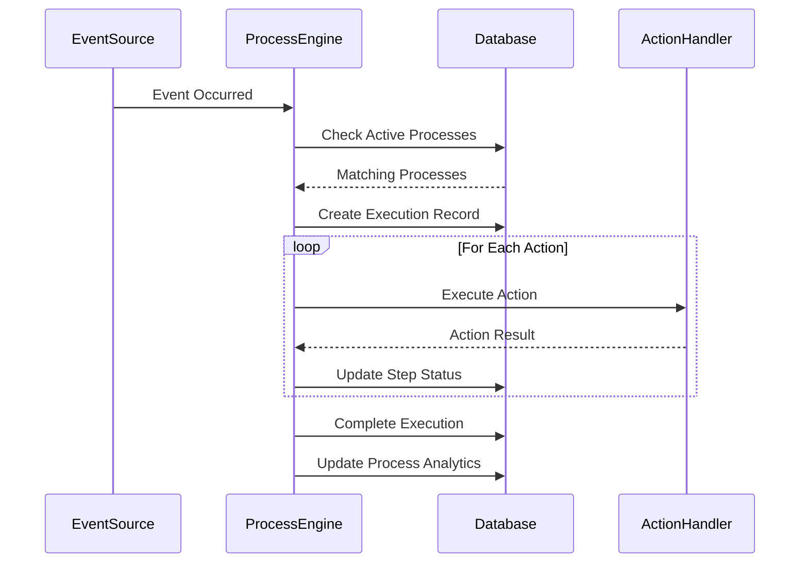

# Firefly Station Processes Module Design Specification

## Overview

The Processes module provides a comprehensive workflow/process management system for the Meshtastic-based Firefly station management system. It enables users to create, monitor, and manage automated processes that respond to events and execute actions across the system.

### Key Features

- **Process Definition**: Create processes with triggers, conditions, and actions
- **Event-Driven Execution**: Automatic execution based on system events (zone changes, alerts, messages)
- **Status Monitoring**: Real-time tracking of process executions and performance
- **Process Templates**: Reusable templates for common workflows
- **Analytics**: Execution statistics and performance metrics
- **Integration**: Seamless integration with alerts, zones, bots, users, and geolocation modules

### Architecture Principles

- **Event-Driven**: Processes are triggered by system events
- **Modular Actions**: Actions integrate with existing system modules
- **Conditional Logic**: Support for conditions and branching
- **Audit Trail**: Full logging of process executions
- **Scalable Design**: Support for complex workflows

## Database Schema

### Core Tables

#### processes
```sql
CREATE TABLE processes (
    id INTEGER PRIMARY KEY AUTOINCREMENT,
    name TEXT NOT NULL,
    description TEXT,
    template_id INTEGER,
    created_by INTEGER,
    created_at TIMESTAMP DEFAULT CURRENT_TIMESTAMP,
    updated_at TIMESTAMP DEFAULT CURRENT_TIMESTAMP,
    is_active BOOLEAN DEFAULT TRUE,
    execution_count INTEGER DEFAULT 0,
    last_executed TIMESTAMP,
    success_rate REAL DEFAULT 0.0,
    avg_execution_time REAL,
    FOREIGN KEY (template_id) REFERENCES process_templates (id),
    FOREIGN KEY (created_by) REFERENCES admin_users (id)
);
```

#### process_triggers
```sql
CREATE TABLE process_triggers (
    id INTEGER PRIMARY KEY AUTOINCREMENT,
    process_id INTEGER NOT NULL,
    trigger_type TEXT NOT NULL, -- 'zone_entry', 'zone_exit', 'alert_created', 'message_received', 'time_schedule', 'manual'
    trigger_config TEXT NOT NULL, -- JSON configuration
    conditions TEXT, -- JSON conditions (AND/OR logic)
    priority INTEGER DEFAULT 0,
    is_active BOOLEAN DEFAULT TRUE,
    created_at TIMESTAMP DEFAULT CURRENT_TIMESTAMP,
    FOREIGN KEY (process_id) REFERENCES processes (id)
);
```

#### process_actions
```sql
CREATE TABLE process_actions (
    id INTEGER PRIMARY KEY AUTOINCREMENT,
    process_id INTEGER NOT NULL,
    action_type TEXT NOT NULL, -- 'send_message', 'create_alert', 'update_zone', 'trigger_bot', 'update_user_group', 'send_notification'
    action_config TEXT NOT NULL, -- JSON configuration
    conditions TEXT, -- JSON conditions for execution
    action_order INTEGER NOT NULL,
    timeout_seconds INTEGER DEFAULT 30,
    retry_count INTEGER DEFAULT 0,
    created_at TIMESTAMP DEFAULT CURRENT_TIMESTAMP,
    FOREIGN KEY (process_id) REFERENCES processes (id)
);
```

#### process_executions
```sql
CREATE TABLE process_executions (
    id INTEGER PRIMARY KEY AUTOINCREMENT,
    process_id INTEGER NOT NULL,
    triggered_by TEXT, -- user_id or 'system'
    trigger_event TEXT, -- JSON event data
    started_at TIMESTAMP DEFAULT CURRENT_TIMESTAMP,
    completed_at TIMESTAMP,
    status TEXT DEFAULT 'running', -- 'running', 'completed', 'failed', 'timeout'
    error_message TEXT,
    execution_time_ms INTEGER,
    steps_completed INTEGER DEFAULT 0,
    total_steps INTEGER,
    FOREIGN KEY (process_id) REFERENCES processes (id)
);
```

#### process_execution_steps
```sql
CREATE TABLE process_execution_steps (
    id INTEGER PRIMARY KEY AUTOINCREMENT,
    execution_id INTEGER NOT NULL,
    action_id INTEGER NOT NULL,
    started_at TIMESTAMP DEFAULT CURRENT_TIMESTAMP,
    completed_at TIMESTAMP,
    status TEXT DEFAULT 'pending', -- 'pending', 'running', 'completed', 'failed', 'skipped'
    result TEXT, -- JSON result data
    error_message TEXT,
    execution_time_ms INTEGER,
    retry_count INTEGER DEFAULT 0,
    FOREIGN KEY (execution_id) REFERENCES process_executions (id),
    FOREIGN KEY (action_id) REFERENCES process_actions (id)
);
```

#### process_templates
```sql
CREATE TABLE process_templates (
    id INTEGER PRIMARY KEY AUTOINCREMENT,
    name TEXT NOT NULL,
    description TEXT,
    category TEXT, -- 'emergency', 'maintenance', 'communication', 'monitoring'
    template_data TEXT NOT NULL, -- JSON template structure
    usage_count INTEGER DEFAULT 0,
    created_by INTEGER,
    created_at TIMESTAMP DEFAULT CURRENT_TIMESTAMP,
    is_public BOOLEAN DEFAULT TRUE,
    FOREIGN KEY (created_by) REFERENCES admin_users (id)
);
```

## API Endpoints

### Process Management

#### GET /api/processes
- **Description**: List processes with filtering and pagination
- **Parameters**: limit, offset, active_only, template_id, created_by
- **Response**: {processes: [...], total: number}

#### GET /api/processes/{id}
- **Description**: Get process details with triggers and actions
- **Response**: Process object with triggers and actions arrays

#### POST /api/processes
- **Description**: Create new process
- **Body**: {name, description, triggers: [...], actions: [...]}
- **Response**: {process_id: number}

#### PUT /api/processes/{id}
- **Description**: Update process
- **Body**: Same as create
- **Response**: {message: "updated"}

#### DELETE /api/processes/{id}
- **Description**: Deactivate process
- **Response**: {message: "deactivated"}

#### POST /api/processes/{id}/execute
- **Description**: Manually execute process
- **Body**: {trigger_data: {}}
- **Response**: {execution_id: number}

### Execution Monitoring

#### GET /api/processes/executions
- **Description**: List process executions
- **Parameters**: process_id, status, limit, offset
- **Response**: {executions: [...], total: number}

#### GET /api/processes/executions/{id}
- **Description**: Get execution details with steps
- **Response**: Execution object with steps array

#### GET /api/processes/executions/{id}/logs
- **Description**: Get execution logs
- **Response**: {logs: [...]}

### Templates

#### GET /api/processes/templates
- **Description**: List available templates
- **Response**: {templates: [...]}

#### POST /api/processes/templates
- **Description**: Create template from process
- **Body**: {process_id, name, description, category}
- **Response**: {template_id: number}

#### POST /api/processes/templates/{id}/instantiate
- **Description**: Create process from template
- **Body**: {customizations: {}}
- **Response**: {process_id: number}

### Analytics

#### GET /api/processes/analytics/overview
- **Description**: Get system-wide process analytics
- **Response**: {total_processes, total_executions, success_rate, avg_execution_time, ...}

#### GET /api/processes/{id}/analytics
- **Description**: Get process-specific analytics
- **Response**: {execution_count, success_rate, avg_execution_time, failure_reasons: [...]}

## Frontend Components

### ProcessList Component
- **Purpose**: Display list of processes with status and metrics
- **Features**:
  - Filter by status, template, creator
  - Sort by name, last executed, success rate
  - Quick actions: execute, edit, deactivate
  - Real-time status updates

### ProcessBuilder Component
- **Purpose**: Create and edit processes
- **Features**:
  - Visual workflow builder (drag-and-drop)
  - Trigger configuration forms
  - Action configuration with validation
  - Condition builder for branching logic
  - Template selection and customization

### ProcessMonitor Component
- **Purpose**: Monitor process executions
- **Features**:
  - Real-time execution dashboard
  - Execution timeline visualization
  - Step-by-step execution tracking
  - Error logs and troubleshooting
  - Performance metrics

### ProcessTemplates Component
- **Purpose**: Manage process templates
- **Features**:
  - Template library with categories
  - Template usage statistics
  - Create templates from existing processes
  - Import/export templates

## Integration Points

### Alert System Integration
- **Trigger**: alert_created, alert_acknowledged, alert_resolved
- **Actions**: create_alert, acknowledge_alert, resolve_alert
- **Hooks**: Process triggers checked in alert creation/update endpoints

### Zone/Geolocation Integration
- **Trigger**: zone_entry, zone_exit, user_online, user_offline
- **Actions**: update_zone, get_users_in_zone
- **Hooks**: Process triggers checked in geolocation update endpoints

### Bot System Integration
- **Trigger**: message_received, bot_trigger_fired
- **Actions**: trigger_bot_response, send_message
- **Hooks**: Process triggers checked in message processing

### User Management Integration
- **Trigger**: user_registered, user_group_changed
- **Actions**: update_user_group, send_notification
- **Hooks**: Process triggers checked in user management endpoints

## Workflow Diagrams

### Process Execution Flow


### Process Creation Flow


### Integration Sequence


## Analytics and Monitoring

### Key Metrics
- **Process Performance**: Success rate, average execution time, failure reasons
- **System Health**: Active processes, execution queue length, error rates
- **Usage Patterns**: Most used templates, peak execution times, trigger frequencies

### Monitoring Features
- **Real-time Dashboards**: Live execution status, system load
- **Alert Integration**: Process failures trigger system alerts
- **Audit Logs**: Complete execution history with searchable logs
- **Performance Trends**: Historical analytics with charts and reports

## Security Considerations

- **Permission-based Access**: processes:create, processes:execute, processes:view permissions
- **Audit Trail**: All process changes and executions logged
- **Input Validation**: Strict validation of process configurations
- **Execution Limits**: Prevent infinite loops and resource exhaustion
- **Timeout Handling**: Automatic termination of long-running processes

## Implementation Phases

### Phase 1: Core Framework
- Basic process CRUD operations
- Simple trigger types (manual, time)
- Basic actions (send_message, create_alert)
- Execution engine with sequential processing

### Phase 2: Advanced Features
- Event-based triggers (zone, alert integration)
- Conditional logic and branching
- Process templates
- Enhanced monitoring

### Phase 3: Enterprise Features
- Parallel execution
- Complex workflows with sub-processes
- Advanced analytics
- API integrations

## Conclusion

This design provides a robust, scalable workflow management system that integrates seamlessly with the existing Firefly station modules. The event-driven architecture ensures responsive automation while the modular design allows for easy extension and customization. The comprehensive monitoring and analytics capabilities provide visibility into process performance and system health.